---
short-description: Simple getting started guide
...

# The Absolute Beginner's Guide to Installing and Using Meson

This page is meant for people who are new to using Meson and possibly
even to compiling C and/or C++ code in general. It is meant to contain
one simple way of getting your build environment up and running. If
you are more experienced and have your own preferred way of installing
and using development software, feel free to use that instead. This
guide only deals with Linux, Windows and macOS platforms. If you use
some other platform, such as one of the BSDs, you probably already
know how to install development tools on it (probably better than we
do, even).

There are three phases to getting a development environment running.

1. Installing a compiler toolchain
2. Installing Meson
3. Creating a project and building it

## Installing a compiler toolchain

 
Linux

All Linux distributions provide easy access to development tools.
Typically you need to open a terminal and execute one command, which
depends on your distro.

 - Debian, Ubuntu and derivatives: `sudo apt install build-essential`
 - Fedora, Centos, RHEL and derivatives: `sudo dnf install gcc-c++`
 - Arch: `sudo pacman -S gcc`

 
Windows

The most common development toolchain on Windows is Visual Studio,
which can be downloaded from [the Visual Studio web
site](https://visualstudio.microsoft.com/). Select the Community
version unless you have bought a license.

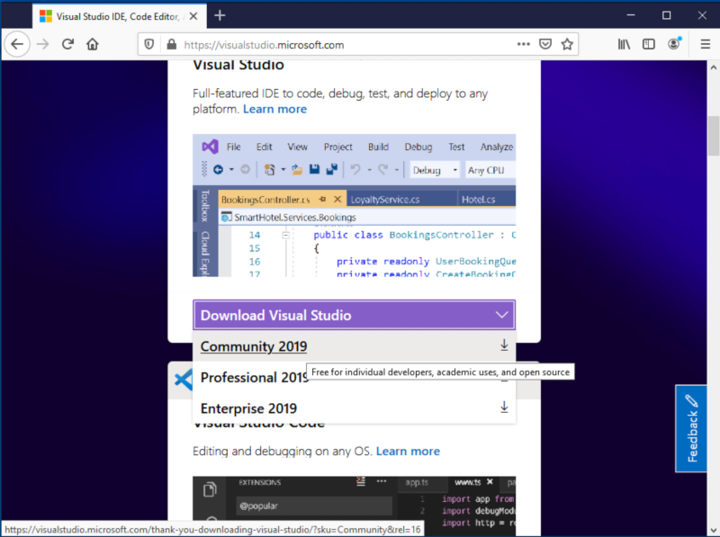

Download the installer and run it. When you are given a list of things
to install, select *Desktop development with C++*. This installs both
a C and a C++ compiler.

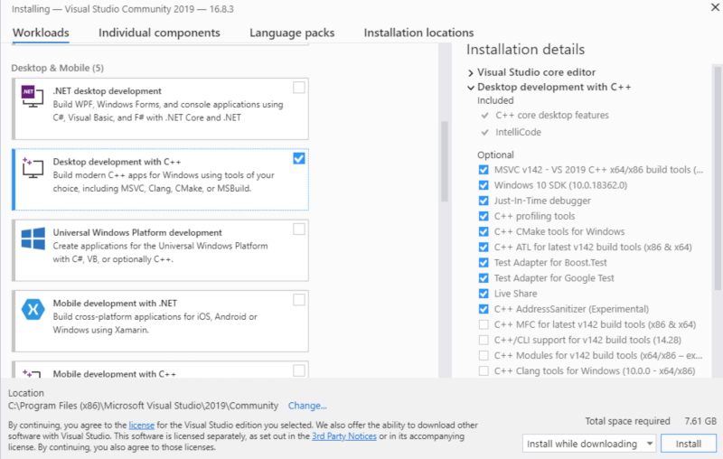

Once the installer finishes the compiler toolchain is ready to use.
 

 
macOS

On macOS the development toolchain must be installed via the Mac app
store. Search for an app called XCode and install it.

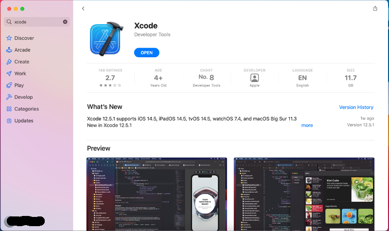

*Note:* Installing XCode is not sufficient by itself. You also need to
start XCode' GUI application once. This will make XCode download and
install more files that are needed for compilation.
 
 

## Installing Meson

 
Linux

Installing Meson is just as simple as installing the compiler toolchain.

 - Debian, Ubuntu and derivatives: `sudo apt install meson ninja-build`
 - Fedora, Centos, RHEL and derivatives: `sudo dnf install meson ninja-build`
 - Arch: `sudo pacman -S meson`
 

 
Windows

Meson provides a standard Windows `.msi` installer that can be
downloaded from [the Releases
page](https://github.com/mesonbuild/meson/releases).

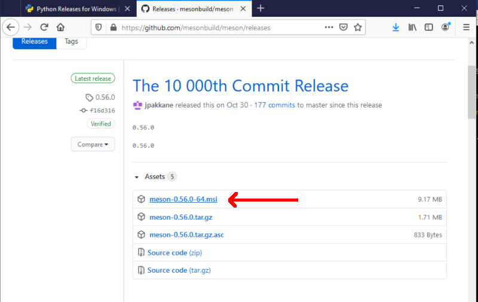

Download and run it to install all the necessary bits. You can verify
that your installation is working by running the Visual Studio
developer tools command prompt that can be found in the start menu.

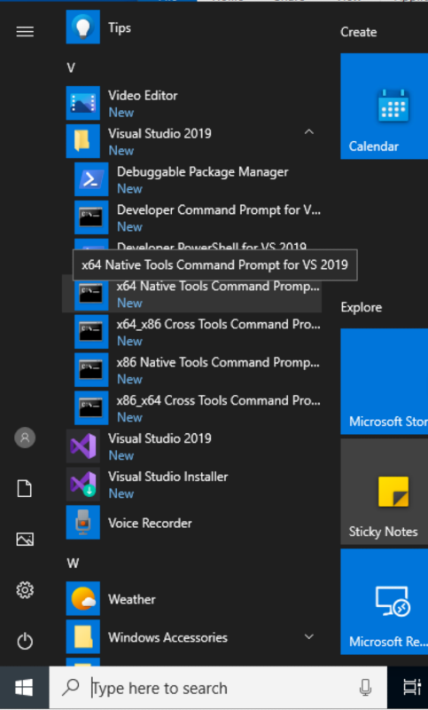

You should be able to run both `meson` and `ninja` and query their
versions.

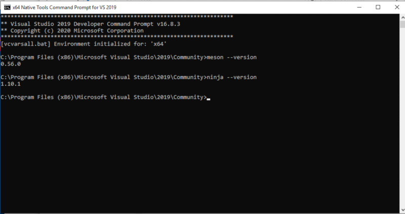
 

 
macOS

#### With Homebrew
`brew install meson ninja`

#### Without Homebrew
Start by downloading the installation package from [the Releases
page](https://github.com/mesonbuild/meson/releases).

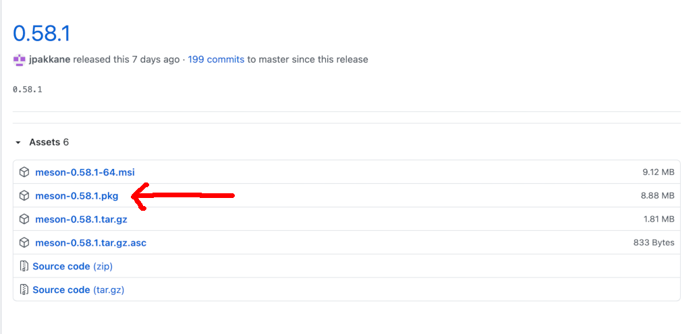

Double click the downloaded installer to start. If you are running a
new macOS version, it might refuse to run the application with the
following error message:

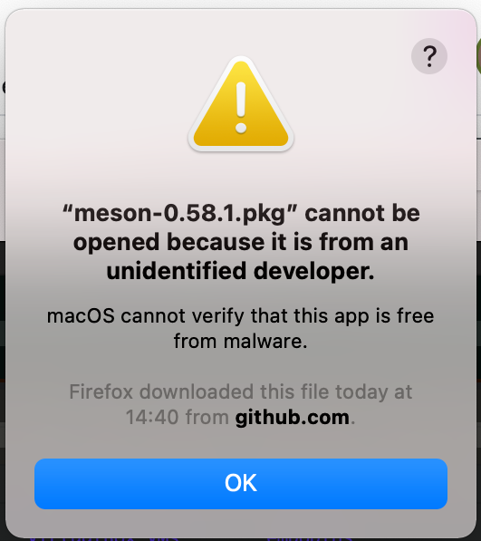

This can be fixed by starting System Preferences, selecting the
Security and Privacy entry. At the bottom it shows the blocked app and
you can enable it by clicking on the "Open anyway" button.

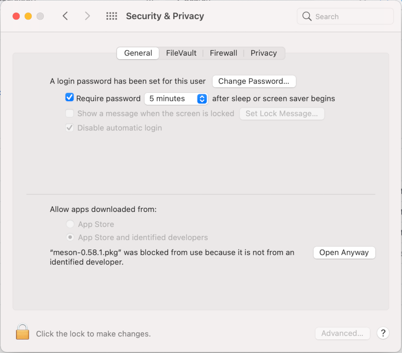

Now the installer should start. If not, double click on the downloaded
installer file again.

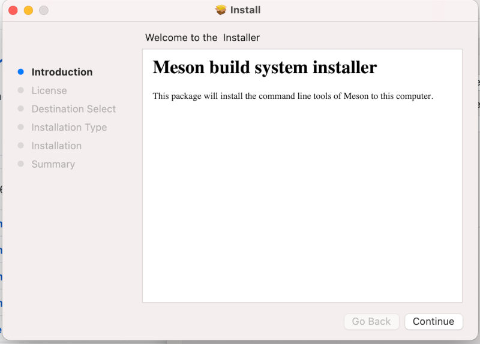

Once the installation is finished you can verify that the system is working via the terminal app.

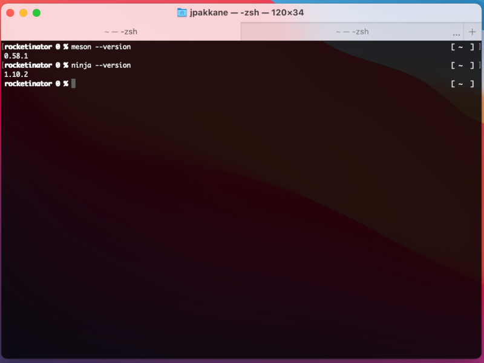
 

## Running Meson

Start a terminal application. On Windows you have to use the Visual
Studio Developer Tools Command Prompt as discussed above, because the
compilers are only available in that terminal. You also need to change
into your home directory (Linux and macOS terminals start in the home
directory by default).

    cd \users\username

Create a new directory to hold your project.

    mkdir testproject
    cd testproject

Use Meson to create and build a new sample project.

    meson init --name testproject --build

This will create a project skeleton for you and compile it. The result
is put in the `build` subdirectory and can be run directly from there.

    build/testproject

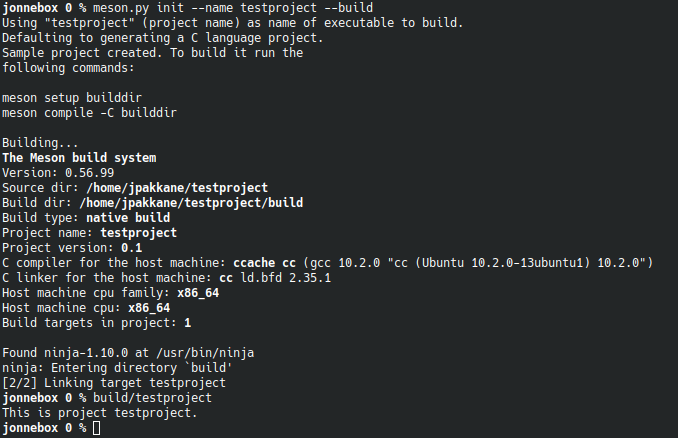

The project is now ready for development. You can edit the code with
any editor and it is rebuilt by going in the `build` subdirectory and
executing the `meson compile` command. If your version of Meson is too
old, you can compile the project by running the command `ninja`
instead.
